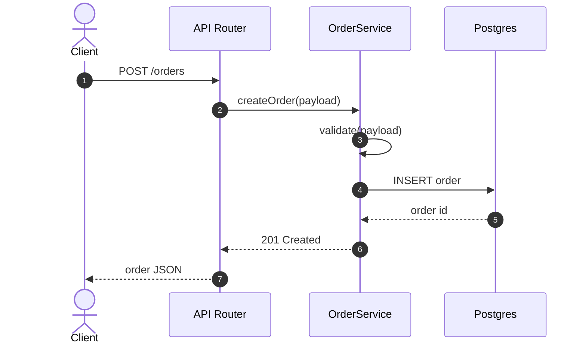
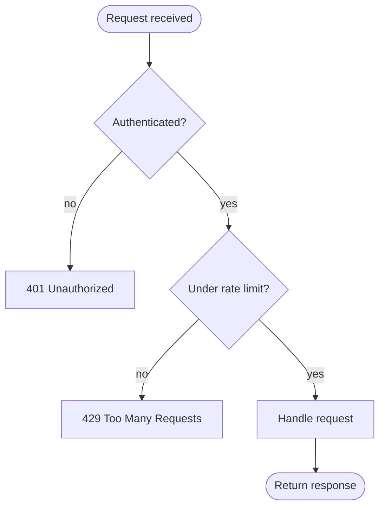
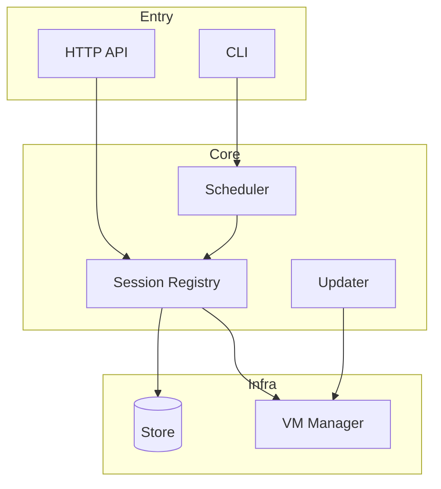
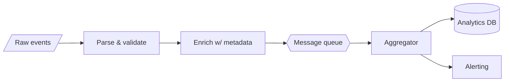
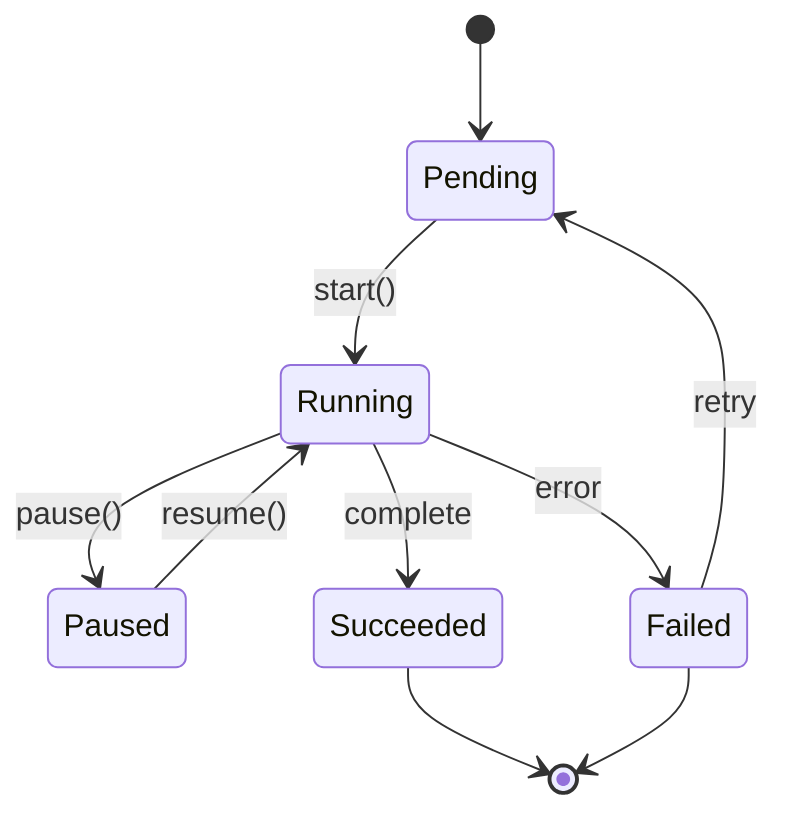

# Mermaid recipes for flow maps

Copy-ready templates for the diagram types this skill produces, plus the syntax gotchas
that most often make a diagram fail to render. Read the relevant section before writing a
diagram; skim the "Gotchas" section once — those bugs are cheap to avoid and expensive to
debug in a committed doc.

## Table of contents
- [Sequence — request/execution lifecycle](#sequence)
- [Flowchart — branching process](#flowchart-process)
- [Flowchart — module / dependency map](#flowchart-modules)
- [Flowchart — data flow](#flowchart-data)
- [State diagram — lifecycles](#state)
- [Gotchas that break rendering](#gotchas)
- [Styling and readability](#styling)

---

<a name="sequence"></a>
## Sequence — request/execution lifecycle

Best when the story is "A calls B, B calls C, C responds" over time. Each participant is
a real component (a module, service, process, external system) — not every function.



- `->>` solid arrow = call; `-->>` dashed = return/response.
- Use `alt`/`else`/`end` for branches, `loop`/`end` for repetition, `Note over X: ...`
  for annotations, `activate`/`deactivate` (or `+`/`-` on arrows) for lifelines.
- Keep participants to ~3–6. More than that and a flowchart usually reads better.

<a name="flowchart-process"></a>
## Flowchart — branching process

Best for logic with decisions and multiple outcomes.



- Node shapes carry meaning: `([text])` start/end, `{text}` decision, `[text]` process,
  `[(text)]` datastore, `[[text]]` subroutine.
- Direction: `TD` top-down for process logic, `LR` left-right for pipelines.

<a name="flowchart-modules"></a>
## Flowchart — module / dependency map

The orientation diagram. Group related components with `subgraph`; arrows are
"depends on / calls".



- Keep it to the ~7–12 components that matter. This is a map, not an inventory.
- Use `subgraph` to encode layers/bounded contexts — it does a lot of explaining for free.

<a name="flowchart-data"></a>
## Flowchart — data flow

Left-to-right, emphasizing transformation stages and stores/boundaries.



- `[/text/]` input/output, `{{text}}` queue/broker, `[(text)]` database. These shapes let
  a reader parse the pipeline at a glance.

<a name="state"></a>
## State diagram — lifecycles

For a stateful entity: what states exist and what triggers transitions.



- `[*]` is the start/end pseudo-state. Label transitions with the event/method that
  causes them — that's the part that ties the diagram back to code.

<a name="gotchas"></a>
## Gotchas that break rendering

These are the failures that turn a committed diagram into a broken block. Avoid them up
front:

- **Special characters in labels.** Parentheses, colons, `<`/`>`, `#`, quotes, and `[]`
  inside a label often break the parser. Wrap the label in double quotes:
  `A["handler(req, res)"]`. For HTML-ish characters use entities: `#quot;`, `#35;`.
- **Reserved words as node IDs.** `end`, `graph`, `state`, `click`, `class` as a bare
  node id can break things. Capitalize or prefix them (`End1`, `nEnd`).
- **Edge labels with special chars** — same rule: `A -->|"GET /x?y=1"| B`.
- **`@` and `/` in sequence messages** are usually fine, but a stray `:` inside a message
  after the colon separator confuses parsing — quote or rephrase.
- **Mismatched `subgraph`/`end`** — every `subgraph` needs a matching `end`.
- **Blank first line** — the diagram type keyword (`flowchart TD`, `sequenceDiagram`)
  must be the first non-empty line inside the ```mermaid fence.
- **Comments** use `%%` at line start, not `//` or `#`.

If a validator script is available in this skill's `scripts/`, run it over your diagrams
before finalizing. Otherwise, re-read each diagram against these rules.

<a name="styling"></a>
## Styling and readability

- **One idea per diagram.** If you're tempted to add a second concern, that's a second
  diagram.
- **Label edges** with the verb or condition (`validate`, `on error`, `if cached`) — an
  unlabeled arrow is a missed teaching opportunity.
- **Order matters** in sequence diagrams and top-down flowcharts; make the reading order
  match the execution order.
- **Node count 5–12.** Below 5 the diagram may be too trivial to bother; above 12 split it.
- Keep labels short — a few words. The prose around the diagram carries the detail.
